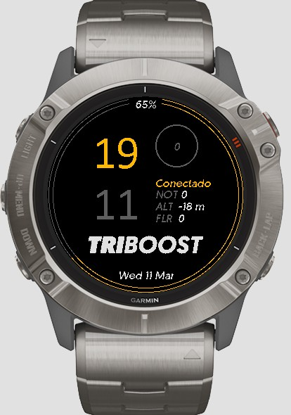

# Triboost Watchface for Garmin

## Description

Triboost Watchface is a custom watchface for Garmin watches, designed for the Triboost Sports Club. Compatible with Fenix 6X Pro and other recent models (see manifest.xml for full list).

## Features

- Large hour and minute display
- Current date
- Battery percentage
- Altitude
- Daily steps
- Floors climbed
- Phone connectivity status
- Notifications
- Triboost logo centered at the bottom of the watchface

## Recent Changes

- Triboost logo centered horizontally (not affected by launcher icon)
- New independent drawable `triboost_logo`
- Images resized for Fenix devices
- Support for white and yellow logos
- Resource and cache cleanup

## Installation

1. Download the `.prg` file from the `bin/` folder or from the GitHub Releases section.
2. Use Garmin Connect IQ Simulator or your compatible device to install the watchface.

## Supported Devices

- Fenix 6, 6S, 6X, 7, 7S, 7X, Epix, Venu, Instinct, modern Forerunner (see manifest.xml)

## Contact

If you have issues or suggestions, open an issue on GitHub or contact the Triboost club at [triboost.club](https://www.triboost.club/).

---
# Triboost Watchface para Garmin

## Descripción

Triboost Watchface es una esfera personalizada para relojes Garmin, diseñada para el club Triboost Sports. Compatible con Fenix 6X Pro y otros modelos recientes (ver manifest.xml para lista completa).

## Funcionalidades

- Visualización de hora y minutos en formato grande
- Fecha actual
- Porcentaje de batería
- Altitud
- Pasos diarios
- Pisos ascendidos
- Estado de conexión con el teléfono
- Notificaciones
- Logo Triboost centrado en la parte inferior de la esfera

## Cambios recientes

- Logo Triboost centrado horizontalmente (no afectado por el launcher icon)
- Nuevo drawable independiente `triboost_logo`
- Imágenes redimensionadas para dispositivos Fenix
- Soporte para logos blanco y amarillo
- Limpieza de recursos y caché

## Instalación

1. Descarga el archivo `.prg` de la carpeta `bin/` o desde la sección Releases de GitHub.
2. Usa Garmin Connect IQ Simulator o tu dispositivo compatible para instalar la esfera.

## Dispositivos soportados

- Fenix 6, 6S, 6X, 7, 7S, 7X, Epix, Venu, Instinct, Forerunner modernos (ver manifest.xml)

## Contacto

Si tienes problemas o sugerencias, abre un issue en GitHub o contacta con el club Triboost en [triboost.club](https://www.triboost.club/).